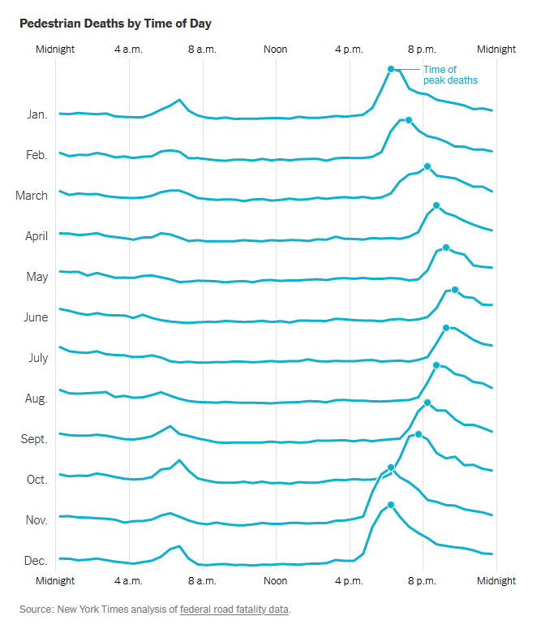

```{r setup, include=FALSE}
knitr::opts_chunk$set(echo = FALSE)
```

```{r load-libraries}
library(tidyverse)
library(haven)
library(sf)
library(lutz)
library(suncalc)
library(extrafont)
library(hrbrthemes)
library(gt)
options(timeout = 300) # files are large...
```

There is a pedestrian fatality crisis in the United States After years of progress, the number of people killed while walking started rising again around 2010, contrary to what's happening outside of the US.
A [recent article in the New York Times](https://www.nytimes.com/interactive/2023/12/11/upshot/nighttime-deaths.html) took a closer look at the fatality data and made a convincing case that the crisis specifically is a crisis happening at night.
This chart shows the peak of pedestrian fatalities shifting over the course of the year, presumably corresponding with when the sun rises and sets.

{width=70%}

It occurred to me and my fellow data nerd Austin Griessbach that we can explicitly look at sunrise and sunset times and how they correlate with the time of a crash.
This turned out to be a more complicated process than expected and I document my part of it at the end of the article, in the Methods section.
Most people probably won't care about that though, and so let's dive into our findings.

# The hour after sunset is the worst time for pedestrian deaths

```{r sunset-main-chart, layout="l-page", fig.width=11, fig.height=6.2}
# load cleaned data. Data cleaning is documented in Methods section at the end of this article
peds <- readRDS("data/peds_with_sunset.rds")
peds <- peds |>
  st_drop_geometry()

peds |>
  filter(YEAR > 2000) |>
  filter(abs(as.numeric(time_from_sunset_min, units = "hours")) < 6.125) |>
  ggplot(aes(as.numeric(time_from_sunset_min, units = "hours"))) +
  geom_histogram(binwidth = 1 / 4) +
  geom_vline(xintercept = 0, color = "red", alpha = 0.3, linewidth = 1) +
  # facet_wrap(~YEAR) +
  ylab("Pedestrian fatalities") +
  xlab("Hours from sunset") +
  labs(
    title = "Crashes are highly concentrated right after sunset",
    subtitle = "Fatal pedestrian crashes in the US, 2001-2021; 15-minute bins",
    caption = "Data: Fatality Analysis Reporting System (FARS)\nVisualization: Harald Kliems"
  ) +
  theme_ipsum(base_family = "Roboto Condensed") +
  annotate(geom = "text", x = .5, y = 5400, label = "Peak about 20-50\n minutes after sunset", family = "Roboto Condensed") +
  annotate("segment",
    x = 22.5 / 60, xend = 52.5 / 60, y = 4950, yend = 4950,
    arrow = arrow(ends = "both", angle = 90, length = unit(.2, "cm"))
  ) +
  annotate(geom = "text", x = -2.8, y = 2000, label = "No marked increase right\nbefore/after sunset", hjust = 0, family = "Roboto Condensed") +
  annotate(geom = "text", x = 3.3, y = 3000, label = "Gradual decline for several           \nhours after sunset", family = "Roboto Condensed") +
  geom_curve(x = -1, xend = -.05, y = 2000, yend = 800, curvature = -.3, arrow = arrow(type = "closed", length = unit(.2, "cm"))) +
  geom_curve(x = 1.5, xend = 4.5, y = 3900, yend = 1690, arrow = arrow(type = "closed", length = unit(.2, "cm")), curvature = .2)
```

This chart is stunning: The number of fatal pedestrian crashes is fairly flat for several hours before sunset.
Crashes don't start going up right before sunset or in the first few minutes after, when the sun is low and with news reports frequently [mentioning glare](https://www.goshennews.com/news/updated-driver-tells-goshen-police-suns-glare-blinded-him-in-fatal-crash/article_df2c5d76-3dd0-11ed-a46b-cfc0e5767813.html) as a factor contributing to crashes.
But within less than an hour of sunset, pedestrian fatalities spike.
And they spike *a lot*.
In the 15 minutes right before/after sunset, 683 pedestrians were killed.
45 minutes later, that number is 4802, more than 7 times as many!
The spike is so pronounced that it looks like an error.
But we checked and re-checked the data and could not find any errors in the analysis (see also below for some data checks).
After the peak within the first hour over sunset, the number of crashes declines.
The decline is gradual, and the number of crashes remains much higher than before sunset.

# Is there a similar pattern around sunrise?

What does the pattern look like for sunrise?
It is largely a less dramatic version of the sunset chart.

```{r sunrise-main-chart, layout="l-page", fig.width=11, fig.height=6.2}
peds |>
  filter(YEAR > 2000) |>
  filter(abs(as.numeric(time_from_sunrise_min, units = "hours")) < 6.125) |>
  ggplot(aes(as.numeric(time_from_sunrise_min, units = "hours"))) +
  geom_histogram(binwidth = 1 / 4) +
  geom_vline(xintercept = 0, color = "red", alpha = 0.3, linewidth = 1) +
  ylab("Pedestrian fatalities") +
  xlab("Hours from sunset") +
  ylim(c(0, 5500)) +
  labs(
    title = "Pedestrian fatalities have a less pronounced peak before sunrise",
    subtitle = "Fatal pedestrian crashes in the US, 2001-2021; 15-minute bins",
    caption = "Data: Fatality Analysis Reporting System (FARS)\nVisualization: Harald Kliems"
  ) +
  theme_ipsum(base_family = "Roboto Condensed") +
  annotate(geom = "text", x = -.5, y = 2450, label = "Peak about 20-50\n minutes before sunrise", family = "Roboto Condensed") +
  annotate("segment",
    x = -22.5 / 60, xend = -52.5 / 60, y = 1980, yend = 1980,
    arrow = arrow(ends = "both", angle = 90, length = unit(.2, "cm"))
  ) +
  annotate(geom = "text", x = 1.8, y = 2000, label = "Local minimum\naround sunrise", family = "Roboto Condensed") +
  annotate(geom = "text", x = -3.1, y = 1600, label = "Gradual increase starting\n ~2 hours before sunrise", family = "Roboto Condensed") +
  geom_curve(x = 1, xend = .05, y = 2000, yend = 800, curvature = .3, arrow = arrow(type = "closed", length = unit(.2, "cm"))) +
  geom_curve(x = -2.5, xend = -1.1, y = 820, yend = 1700, arrow = arrow(type = "closed", length = unit(.2, "cm")), curvature = .2)
```

Pedestrian fatalities start increasing about 3 hours before sunset, peak 20-50 minutes before sunset, and rapidly decline right before and after sunset, and then stay relatively flat.
The peak 15-minutes has fewer than 1800 fatalities, and that 1800 is only 4 times as many as in the low period around sunrise.

# A different way to look at the data

Rather than using bar charts to show the crashes in relation to sunset and time, Austin put all the data together and added it to an animated map.

{width=100%}

# Some data checks, and searching for explanations

As we said, the charts are stunning.
Austin and I couldn't really believe what we were seeing.
And when I posted an early version of the chart to Mastodon, many readers suspected an error.
We did many robustness checks (including independently cleaning and analyzing the data in Python and R), and at this point we're pretty confident that the data are correct.
As to an explanation of *why* we're seeing these patterns, we're mostly stumped.
Sure, as the New York Times wrote, there are a lot of possible explanations of why more pedestrians in the US die *at night*.
But that those deaths are so heavily concentrated right after sunset (and, to a lesser extent: right before sunrise) is difficult to explain.
Breaking down the data by additional variables may help support or rule out possible explanations.

What about differentiating the data by state?
Here's a our sunrise chart from above, but faceted by state:

```{r state-facets, layout="l-page", fig.width=11, fig.height=6.2}
state_fips <- tigris::fips_codes |>
  distinct(state_code, .keep_all = T) |>
  mutate(state_code = as.numeric(state_code)) |>
  select(state_code, state)

peds_state_facets <- peds |>
  ungroup() |>
  left_join(state_fips, by = join_by(STATE == state_code)) |>
  filter(abs(as.numeric(time_from_sunset_min, units = "hours")) < 6.125) |>
  mutate(states_binned = fct_lump(state, n = 11))

peds_state_facets |>
  ggplot(aes(as.numeric(time_from_sunset_min, units = "hours"))) +
  geom_histogram(binwidth = 1 / 4) +
  geom_vline(xintercept = 0, color = "red", alpha = 0.3, linewidth = 1) +
  facet_wrap(~states_binned, scales = "free_y") +
  ylab("Pedestrian fatalities") +
  xlab("Hours from sunset") +
  labs(
    title = "Pedestrian fatalities around sunset have a similar pattern across US States",
    subtitle = "Fatal pedestrian crashes in the US, 2001-2021; 15-minute bins",
    caption = "Data: Fatality Analysis Reporting System (FARS)\nVisualization: Harald Kliems"
  ) +
  theme_ipsum(base_family = "Roboto Condensed") +
  theme(
    panel.grid.major = element_blank(),
    panel.grid.minor = element_blank()
  )
```

The pattern does not differ much by state.
Note that the y-axis for each state differs in order to better show the pattern; the overall number of pedestrian fatalities vary a lot by state.

Another test is to look at the pattern by month.

```{r facet-month, layout="l-page", fig.width=11, fig.height=6.2}
peds |>
  mutate(label_month = month(MONTH, label = TRUE)) |>
  filter(abs(as.numeric(time_from_sunset_min, units = "hours")) < 6.125) |>
  ggplot(aes(as.numeric(time_from_sunset_min, units = "hours"))) +
  geom_histogram(binwidth = 1 / 4) +
  geom_vline(xintercept = 0, color = "red", alpha = 0.3, linewidth = .6) +
  facet_wrap(~label_month) +
  ylab("Pedestrian fatalities") +
  xlab("Hours from sunset") +
  labs(
    title = "Pedestrian fatalities around sunset have a similar pattern throughout the year",
    subtitle = "Fatal pedestrian crashes in the US, 2001-2021; 15-minute bins",
    caption = "Data: Fatality Analysis Reporting System (FARS)\nVisualization: Harald Kliems"
  ) +
  theme_ipsum(base_family = "Roboto Condensed") +
  theme(
    panel.grid.major = element_blank(),
    panel.grid.minor = element_blank()
  )
```


Again, the overall pattern stays intact.
From about October to January, the post-sunset peaks appear to be more pronounced, as is the overall number of pedestrian fatalities within 6 hours of sunset.
This is easier to see on a bar plot, and it probably has something to do with pedestrian and vehicle volumes and when sunset happens: Earlier sunsets mean that the "after" period encompasses rush hour; whereas late sunsets in the summer occur after peak traffic.

```{r table-month}
table_month <- peds |>
  mutate(label_month = month(MONTH, label = TRUE)) |>
  filter(abs(as.numeric(time_from_sunset_min, units = "hours")) < 6) |>
  mutate(night = if_else(time_from_sunset_min <= 0, "before", "after")) |>
  group_by(label_month, night) |>
  count()
table_month |>
  ggplot(aes(label_month, n, fill = fct_relevel(night, "before", "after"))) +
  geom_col(position = position_dodge()) +
  labs(
    fill = "Before/after sunset", title = "Fatal pedestrian crashes before and after sunset",
    subtitle = "Crashes within 6 hours of sunset",
    caption = "Data: Fatality Analysis Reporting System (FARS)\nVisualization: Harald Kliems"
  ) +
  xlab("Month") +
  ylab("Pedestrian fatalities") +
  scale_fill_ipsum() +
  theme_ipsum_rc()
```

Finally, we can check if this pattern is new, by separating the data into 5-year periods (which results in not including 2021 data):

```{r five-year-chart,  layout="l-page", fig.width=11, fig.height=6.2}
peds |>
  mutate(year_period = case_match(
    YEAR,
    c(2001:2005) ~ "2001-2005",
    c(2006:2010) ~ "2006-2010",
    c(2011:2015) ~ "2011-2015",
    c(2016:2020) ~ "2016-2020"
  )) |>
  filter(!is.na(year_period)) |>
  filter(abs(as.numeric(time_from_sunset_min, units = "hours")) < 6) |>
  ggplot(aes(as.numeric(time_from_sunset_min, units = "hours"))) +
  geom_histogram(binwidth = 1 / 4) +
  geom_vline(xintercept = 0, color = "red", alpha = 0.3, linewidth = .6) +
  facet_wrap(~year_period) +
  ylab("Pedestrian fatalities") +
  xlab("Hours from sunset") +
  labs(
    title = "The pattern of pedestrian fatalities around sunset has not changed much from 2001 to 2020",
    subtitle = "Fatal pedestrian crashes in the US, 2001-2020; 15-minute bins",
    caption = "Data: Fatality Analysis Reporting System (FARS)\nVisualization: Harald Kliems"
  ) +
  theme_ipsum(base_family = "Roboto Condensed") +
  theme(
    panel.grid.major.x = element_blank(),
    panel.grid.minor.x = element_blank()
  )
```

Once more, the pattern remains intact.
But we can see the increase in nighttime pedestrian fatalities in more recent years.

# What about other countries?

Is what we're seeing a uniquely US phenomenon?
One country for which we found reasonably good data is Germany.
Unfortunately, the crash time is made available only down to the hour, making it impossible to do a 1:1 comparison in relation to the sunrise/sunset times.
Additionally, only data from 2016-2022 is available.
Here's the hourly distribution fatalities to see how German and US pedestrian fatalities compare.

```{r us-de-table}
crashes_de_us <- readRDS("data/crashes_de_us.RDS")

crashes_de_us |>
  group_by(country) |>
  tally() |>
  mutate(population = case_when(
    country == "Germany" ~ 83191000,
    country == "US" ~ 331449281
  )) |>
  rowwise() |>
  mutate(fatal_per_million = n / population * 1000000) |>
  gt() |>
  cols_label(country = "", n = "Fatalities/fatal crashes", population = "Population (2020)", fatal_per_million = "Fatalities/fatal crashes per 1 million") |>
  fmt_number(fatal_per_million, decimals = 1) |>
  fmt_number(c(n, population), use_seps = TRUE, decimals = 0) |> 
  tab_header(title = "Pedestrian fatalities in the US and in Germany, 2016-2021") |>
  tab_source_note(source_note = md("Fatality Analysis Reporing System (FARS); Unfallatlas; Wikipedia <br> Data for Germany is the number of fatal _crashes_ involving a pedestrian; US data is number _fatalities_ for pedestrians)"))
```

The overall number of fatal pedestrian crashes in the Germany is, unsurprisingly, a lot lower than in the US.
This is true both for absolute as population-adjusted numbers.
The US population in 2020 was 331 million; Germany's was 83 million.
From 2016 to 2021, Germany had 22 fatal pedestrian crashes per 1 million population; the US had 116 pedestrian fatalities per 1 million population.

But when do those fatal crashes happen, though?
Here is the chart comparing the two countries.

```{r us-de-chart, layout="l-page", fig.width=11, fig.height=6.2}
crashes_de_us |>
  group_by(country, crash_hour) |>
  tally() |>
  ggplot(aes(x = crash_hour, n, fill = country)) +
  geom_col() +
  theme_minimal() +
  facet_wrap(~country, scales = "free_y") +
  theme_ipsum_rc() +
  scale_fill_ipsum() +
  theme(
    legend.position = "none",
    plot.caption = ggtext::element_textbox_simple(halign = 0)
  ) +
  labs(
    title = "The pattern of fatal pedestrian crashes by time of day differs between the US and Germany",
    fill = element_blank(),
    subtitle = "2016-2021 crash data",
    caption = "Data: Fatality Analysis Reporing System (FARS); Unfallatlas <br> Data for Germany: number of fatal _crashes_ involving a pedestrian; US data: number of _fatalities_ for pedestrians<br>Visualization: Harald Kliems",
    x = "Time of day",
    y = "Number of crashes/fatalities"
  ) +
  scale_x_continuous(breaks = c(0, 6, 12, 18))
```

The distribution across the day definitely looks different.
While both charts have two peaks, the first peak is much later in Germany, around 10 AM; the second peak is both earlier and narrower in Germany, centered around evening rush hour.

# Conclusion: What is going on??

Austin and I split the data in many other ways to try and elucidate what is going on, and to confirm that we weren't looking at weird artefacts or straight up errors in our code or in the data.
At this point were certain enough that the data are correct to publish this post.
If you find any errors in the code, please let us know!

As to *why* were seeing what we're seeing: We're still stumped.
Why such a rapid increase after (but not before!) sunset?
Why is the pattern different in the US than in Germany?
We can't say.
Additional data would be needed to make progress on an explanation.
First and foremost, one would want pedestrian and motor vehicle volume data by time of day, across the year, and for different locations in the US.
Some of that data may exist in the proprietary databases of companies like Streetlight; some of it could be extrapolated from automated traffic counters.
But there are going to be many limitations and gaps, especially for pedestrian data and in non-urban areas.

It may also help to look at other crash types, such as fatal crashes *not* involving pedestrians; fatal bike crashes; or non-fatal injury crashes.
The FARS data only contains fatalities, and while some states make non-fatal crash data available, there are issues with the comparability of the data over time and between states.
And a lot of data cleaning.

For now, we'll leave it to the readers to come up with explanations, based on data or speculation.
And maybe publish a follow-up post at a later point.

## Methods

The following contains and describes the code needed to prepare the data for the plots and tables above.
We want our data to be reproducible and open to checking by others.

### Download FARS data

Complete FARS is available as SAS and csv files for download.
The files are large and downloads regularly time out.
The structure of the folders and files has slight variations between years and therefore reading in the files requires some effort and multiple functions.

```{r download-fars, eval=FALSE}
get_fars <- function(year) {
  fars_url <- paste0(
    "https://static.nhtsa.gov/nhtsa/downloads/FARS/",
    year,
    "/National/FARS",
    year,
    "NationalSAS.zip"
  )
  temp_file <- tempfile()
  download.file(fars_url, destfile = temp_file)
  unzip(temp_file, exdir = paste0("data/", year), overwrite = TRUE)
}

walk(2002:2007, safely(get_fars)) # some years will time out and you'll have to try again
```

Now that we have the data downloaded, we read in two tables, the `PERSON` and the `ACCIDENT` files.
Unfortunately the structure of those files varies over time and so joining them isn't that straightforward.
We define two functions to read the files.

```{r read-functions, eval=FALSE}
# folder structure is inconsistent between years and we need two functions
# to read in the data
read_FARS_subfolder <- function(year, table_type) {
  read_sas(paste0("data/", year, "/FARS", year, "NationalSAS/", table_type, ".sas7bdat"))
}

read_FARS_no_subfolder <- function(year, table_type) {
  read_sas(paste0("data/", year, "/", table_type, ".sas7bdat"))
}
```

The variable in which the latitude and longitude are being saved and their format varies between years.
This requires cleanup.
2000 crash data is the most different.

```{r cleanup-2000, eval=FALSE}
accident_00 <- read_FARS_no_subfolder(2000, "accident")
accident_00 <- accident_00 |>
  mutate(
    LATITUDE = na_if(LATITUDE, "88888888"), # remove missing
    LATITUDE = na_if(LATITUDE, "99999999"), # remove missing
    LATITUDE = paste0(
      "-",
      str_sub(LATITUDE, start = 0, end = 2),
      ".",
      str_sub(LATITUDE, start = 3)
    ),
    LATITUDE = na_if(LATITUDE, "-NA.NA")
  ) |>
  mutate(
    LONGITUD = na_if(LONGITUD, "888888888"),
    LONGITUD = na_if(LONGITUD, "999999999"),
    LONGITUD = paste0(
      str_sub(LONGITUD, start = 0, end = 3),
      ".",
      str_sub(LONGITUD, start = 4)
    ),
    LONGITUD = na_if(LONGITUD, "-NA.NA")
  ) |>
  mutate(across(c(LATITUDE, LONGITUD), ~ as.numeric(.x)))
```

For 2001 to 2007, the coordinates are stored in a different variable.

```{r cleaup-2001-2007, eval=FALSE}
accident_01_05 <- map2_dfr(
  2001:2005,
  "accident",
  read_FARS_no_subfolder
)

accident_01_05 <- accident_01_05 |>
  mutate(
    LATITUDE = latitude,
    LONGITUD = longitud
  )

accident_06_07 <- map2_dfr(
  2006:2007,
  "accident",
  read_FARS_subfolder
)
accident_06_07 <- accident_06_07 |>
  mutate(
    LATITUDE = latitude,
    LONGITUD = longitud
  )
```

Starting in 2008, the coordinate format is all the same, but there's variability whether the data is in subfolders or not.

```{r cleanup-2008-2021, eval=FALSE}
accident_08_15 <- map2_dfr(
  2008:2015,
  "accident",
  read_FARS_subfolder
)


accident_16_19 <- map2_dfr(
  2016:2019,
  "accident",
  read_FARS_no_subfolder
)


accident_20_21 <- map2_dfr(
  2020:2021,
  "accident",
  read_FARS_subfolder
)
```

Now we combine all `accident` data frames.

```{r combine-accidents, eval=FALSE}
accident <- bind_rows(
  accident_00,
  accident_01_05,
  accident_06_07,
  accident_08_15,
  accident_16_19,
  accident_20_21
)
```

For the `person` data files, the only difference is whether they do or do not use subfolders.

```{r read-person, eval=FALSE}
# define the years for which data does/doesn't live in subfolders
no_subfolder_years <- c(2000:2005, 2016:2019)
subfolder_years <- c(2006:2015, 2020:2021)


person_no_subfolder <- map2_dfr(
  no_subfolder_years,
  "person",
  read_FARS_no_subfolder
)
person_subfolder <- map2_dfr(
  subfolder_years,
  "person",
  read_FARS_subfolder
)

person <- bind_rows(person_subfolder, person_no_subfolder)
```

All these steps take time and so we save the `person` and `accident` data as `rds` files.

```{r combine-and-save, eval=FALSE}
saveRDS(person, file = "data/person.RDS")
saveRDS(accident, file = "data/accident.RDS")

person <- readRDS("data/person.RDS")
accident <- readRDS("data/accident.RDS")
```

### Filtering and cleaning the data

FARS data include all traffic fatalities.
We filter the person file to only include cases where the person is a pedestrian and the injury severity is a fatality.

```{r filter-fatal-peds, eval=FALSE}
peds <- person |>
  filter(PER_TYP == 5 & INJ_SEV == 4)
```

The crash locations are in the `ACCIDENT` table.
Not all crashes are geocoded:

```{r determine-geocoded, eval=FALSE}
accident <- accident |>
  mutate(
    LATITUDE = if_else(LATITUDE %in% c(99.9999, 88.8888, 77.7777), NA, LATITUDE),
    LONGITUD = if_else(LONGITUD %in% c(999.9999, 888.8888, 777.7777), NA, LONGITUD)
  ) |>
  mutate(geocoded = if_else(is.na(LATITUDE), "not geocoded", "geocoded"))

accident |>
  group_by(geocoded) |>
  tally()
```

We remove any non-geocoded crashes and the join the two tables, using the `ST_CASE` identifier.
Note that `ST_CASE` is only unique *within* a year.
Also note that there are `person` entries that don't have a corresponding `accident`.
We don't fully understand what type of fatalities those are and will exclude them from analysis.

```{r filter-geocoded-and-join, eval=FALSE}
accident <- accident |>
  filter(geocoded == "geocoded")

peds <- peds |>
  left_join(accident, by = join_by(
    ST_CASE,
    MONTH,
    DAY,
    HOUR,
    MINUTE,
    STATE,
    VE_FORMS,
    COUNTY,
    RUR_URB,
    FUNC_SYS,
    HARM_EV,
    MAN_COLL,
    SCH_BUS
  ))
```

The data contain a lot of variables and for now we'll only keep the ones needed for the time-of-crash analysis.

```{r filter-variable, eval=FALSE}
variables_for_daylight <- c(
  "STATE",
  "ST_CASE",
  "COUNTY",
  "DAY",
  "MONTH",
  "HOUR",
  "MINUTE",
  "YEAR",
  "AGE",
  "SEX",
  "HISPANIC",
  "RACE",
  "LATITUDE",
  "LONGITUD"
)

peds <- peds |>
  select(all_of(variables_for_daylight))
```

We filter for crashes that don't contain an exact time.
We also parse the date and time fields.

```{r parse-date-time, eval=FALSE}
peds <- peds |>
  filter(MINUTE != 99 & !is.na(YEAR)) |>
  mutate(
    crash_time = ymd_hm(paste(YEAR, MONTH, DAY, HOUR, MINUTE, sep = "-")),
    crash_date = ymd(paste(YEAR, MONTH, DAY, sep = "-"))
  )
```

Next we need to deal with time and time zones.
The crash time and date in FARS appear to be stored as the local time, with no time zone information.
We will use the latitude and longitude to look up the time zone and then convert all times into UTC.

```{r time-zones, eval=FALSE}
# create sf object
peds <- st_as_sf(peds, coords = c("LONGITUD", "LATITUDE"), remove = FALSE) # keep lat/lon columns
peds$tz <- tz_lookup(peds, method = "accurate")

# Function to convert times to UTC
convert_to_utc <- function(datetime, timezone) {
  # Set the time zone of the datetime object
  datetime <- force_tz(datetime, tzone = timezone) # assign time zone

  # Convert the datetime to UTC
  datetime_utc <- with_tz(datetime, tzone = "UTC") # convert to time zone

  return(as_datetime(datetime_utc))
}

peds$crash_time_utc <- mapply(convert_to_utc, datetime = peds$crash_time, timezone = peds$tz)

peds <- peds |>
  mutate(
    crash_time_utc = as_datetime(crash_time_utc),
    crash_date_utc = date(crash_time_utc)
  )
```

Based on the new UTC times we can now calculate sunrise and sunsets for all crashes.
This was more complicated than I thought: Once we get to calculating the time to/from the nearest sunrise/sunset, sometimes that sunrise or sunset falls to a different date.
So we calculate the sunrise/sunset for the day before the crash, the day of the crash, and the day after, and then use the minimum difference.
(I feel there must be a simpler way to do this...)

```{r calculcate-sun, eval=FALSE}
peds <- peds |>
  rowwise() |>
  mutate(
    sun_0 = getSunlightTimes(date = crash_date, lat = LATITUDE, lon = LONGITUD),
    sun_plus_1 = getSunlightTimes(date = crash_date + 1, lat = LATITUDE, lon = LONGITUD),
    sun_minus_1 = getSunlightTimes(date = crash_date - 1, lat = LATITUDE, lon = LONGITUD),
    sunrise_0 = sun_0$sunrise,
    sunrise_plus_1 = sun_plus_1$sunrise,
    sunrise_minus_1 = sun_minus_1$sunrise,
    sunset_0 = sun_0$sunset,
    sunset_plus_1 = sun_plus_1$sunset,
    sunset_minus_1 = sun_minus_1$sunset
  )
```

```{r calculate-time-from-sun, eval=FALSE}
peds <- peds |>
  mutate(
    time_from_sunrise_0 = crash_time_utc - sunrise_0,
    time_from_sunset_0 = crash_time_utc - sunset_0,
    time_from_sunrise_minus_1 = crash_time_utc - sunrise_minus_1,
    time_from_sunset_minus_1 = crash_time_utc - sunset_minus_1,
    time_from_sunrise_plus_1 = crash_time_utc - sunrise_plus_1,
    time_from_sunset_plus_1 = crash_time_utc - sunset_plus_1,
    time_from_sunrise_min = case_when(
      min(abs(time_from_sunrise_0), abs(time_from_sunrise_minus_1), abs(time_from_sunrise_plus_1)) == abs(time_from_sunrise_0) ~ time_from_sunrise_0,
      min(abs(time_from_sunrise_0), abs(time_from_sunrise_minus_1), abs(time_from_sunrise_plus_1)) == abs(time_from_sunrise_minus_1) ~ time_from_sunrise_minus_1,
      min(abs(time_from_sunrise_0), abs(time_from_sunrise_minus_1), abs(time_from_sunrise_plus_1)) == abs(time_from_sunrise_plus_1) ~ time_from_sunrise_plus_1
    ),
    time_from_sunset_min = case_when(
      min(abs(time_from_sunset_0), abs(time_from_sunset_minus_1), abs(time_from_sunset_plus_1)) == abs(time_from_sunset_0) ~ time_from_sunset_0,
      min(abs(time_from_sunset_0), abs(time_from_sunset_minus_1), abs(time_from_sunset_plus_1)) == abs(time_from_sunset_minus_1) ~ time_from_sunset_minus_1,
      min(abs(time_from_sunset_0), abs(time_from_sunset_minus_1), abs(time_from_sunset_plus_1)) == abs(time_from_sunset_plus_1) ~ time_from_sunset_plus_1
    )
  )

# saveRDS(peds, file = "data/peds_with_sunset.rds")
```

### German crash data

Crash data for 2016 to 2022 are available from <https://unfallatlas.statistikportal.de/>, and it's documented (in English) here [<https://www.opengeodata.nrw.de/produkte/transport_verkehr/unfallatlas/DSB_Unfallatlas_EN.pdf>].
Unfortunately, the minute of the crash is not included in the data.
We download the data to a folder, read it in, and save it for future use as an RDS file.

```{r read-de-crashes, eval=FALSE}
read_de_crashes <- function(crash_file) {
  read_delim(crash_file, delim = ";")
}

crash_files <- list.files("data/de", full.names = TRUE)

crashes_de <- map_dfr(crash_files, read_de_crashes)

saveRDS(crashes_de, "data/crashes_de.RDS")
```

Crashes involving pedestrians are coded with `IstFuss == 1` and fatal crashes are coded as `UKATEGORIE == 1`.
We filter accordingly and then combine with the US fatal pedestrian crash data.
Note that the US data has one row for every pedestrian fatality, whereas the German data has one row per crash.
This may lead to minor difference, e.g regarding crashes that kill multiple pedestrians, or crashes that involve a pedestrian, but it's not the pedestrian who is killed.
Overall, these differences are probably fairly minor.
To make the time periods comparable, we limit the data to 2016-2021.

```{r combine-de-us-crashes, eval=FALSE}
us_crashes <- peds |>
  sf::st_drop_geometry() |>
  mutate(
    crash_hour = HOUR,
    country = "US"
  ) |>
  filter(YEAR > 2015) |>
  select(crash_hour, country)

de_crashes_fatal <- crashes_de |>
  filter(IstFuss == 1 & UJAHR < 2022) |>
  mutate(
    crash_hour = as.numeric(USTUNDE),
    crash_type = case_when(
      UKATEGORIE == 1 ~ "fatal",
      UKATEGORIE == 2 ~ "serious injury",
      UKATEGORIE == 3 ~ "minor injury"
    ),
    crash_type = factor(crash_type, levels = c("fatal", "serious injury", "minor injury"), ordered = TRUE),
    country = "Germany"
  ) |>
  filter(crash_type == "fatal") |>
  select(crash_hour, country)

crashes_de_us <- rbind(us_crashes, de_crashes_fatal)
saveRDS(crashes_de_us, file = "data/crashes_de_us.RDS")
```


```{r session-info}
devtools::session_info()
```

